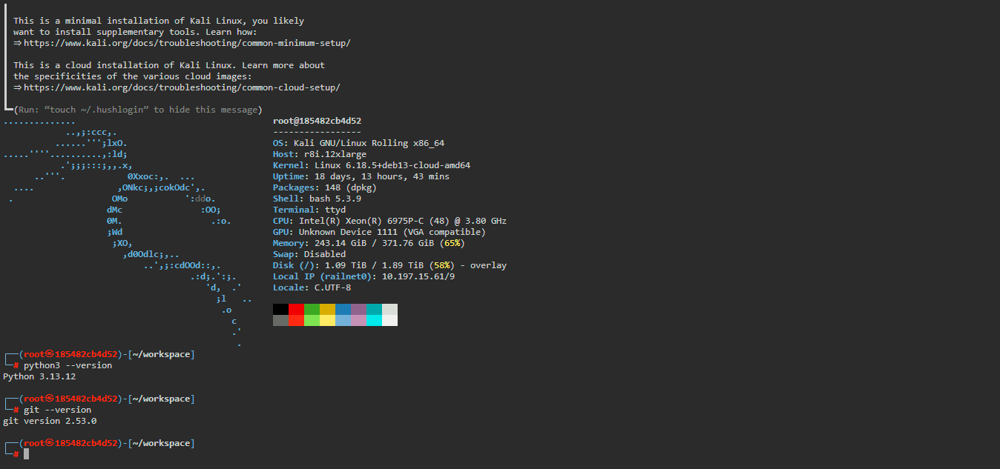

# 🐉 Kali Linux on Browser
**Repository Name:** kali-on-browser

**Template Name:** Kali Linux

## 📖 Description
Looking for a powerful penetration testing environment accessible from anywhere? 🚀 

This project allows you to deploy a **Kali Linux Rolling** instance in the cloud, accessible directly via your web browser. No need for complex SSH tunneling or local Virtual Machines—just a high-performance, web-based terminal for your security audits and learning.

This template utilizes the official `kalilinux/kali-rolling` image and [ttyd](https://github.com/tsl0922/ttyd) to provide a seamless terminal experience with built-in multi-arch support (x86_64 & ARM64).

---

### ✨ Key Features
- 🐉 **Kali Linux Rolling Base:** Always up-to-date with the latest security patches and tools.
- 🔒 **Secure Access:** Password-protected web terminal via Basic Authentication.
- 🚀 **Optimized Init (Tini):** Correctly handles signals and zombie processes within the container.
- 💻 **Modern System Info:** Features `fastfetch` for a sleek system overview upon login.
- 📂 **Workspace Ready:** Pre-configured `/root/workspace` directory for your projects.

---

## 🛠️ Configuration & Variables

### Environment Variables
Configure these variables in the **Variables** tab of your Railway dashboard to secure your instance:

| Variable     | Default | Description                                           |
| :----------- | :------ | :---------------------------------------------------- |
| **USERNAME** | `admin` | Your custom username to login to the web shell.       |
| **PASSWORD** | `admin` | Your secure password to login to the web shell.       |
| **PORT**     | `7681`  | Automatically assigned by Railway (No change needed). |

> **⚠️ SECURITY NOTE:** As this is a security-oriented distribution, it is **strongly advised** to set a custom USERNAME and a strong PASSWORD before deploying to prevent unauthorized access.

---

## 💾 Data Persistence (Volumes)
By default, cloud containers are reset on every deployment. To ensure your scripts, logs, and tools are not lost:
👉 Mount a **Railway Volume** to the following path: `/root/workspace`

All files stored in this directory will remain intact even if the container is restarted or redeployed.

---

## 🚀 Why Deploy on Railway?
- **Instant Access:** Access your Kali terminal from a tablet, laptop, or any public device.
- **Zero Local Setup:** Save your RAM and disk space by offloading the OS to the cloud.
- **Multi-Arch Support:** Intelligent build logic supports both amd64 and arm64 nodes.
- **Security Sandbox:** A safe environment to learn security tools or test Bash/Python scripts without affecting your host OS.

## 🤝 Common Use Cases
- Learning the basics of penetration testing and Linux security.
- Running lightweight network diagnostics and remote scanning.
- Participating in CTF (Capture The Flag) competitions on the go.
- Developing security-related automation scripts in a clean environment.

---

## 📦 Tech Stack
- **Base OS:** `kalilinux/kali-rolling`
- **Init System:** `tini`
- **Terminal Engine:** `ttyd` (Web Terminal via WebSockets)
- **Included Tools:** `wget`, `curl`, `git`, `python3`, `fastfetch`, `iproute2`, `sudo`.

---

## 🛡️ License
Distributed under the **MIT License**. Copyright (c) 2023-2026 **ASEP SAPUTRA**.